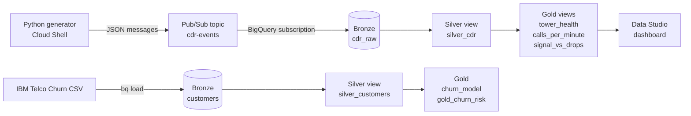

# Real-Time Telecom Network Monitoring Pipeline on GCP

A streaming ELT pipeline that ingests simulated cell tower call records and flags failing towers on a live dashboard. It also includes a batch churn model trained on 7,043 real-style telecom customers.

**Stack:** Python, SQL, Pub/Sub, BigQuery, BigQuery ML, Data Studio (formerly Looker Studio)
**Pattern:** Streaming ELT with a Bronze, Silver, Gold medallion design


---

## Results at a glance

| Metric | Value |
|---|---|
| Call records ingested | **180,871** |
| Throughput | About 1,150 events per minute |
| Streaming window | 3 hours 11 minutes (2 generator runs) |
| Cell towers monitored | 50 |
| Injected failing towers detected | **6 of 6** (3 per run) |
| Duplicate messages removed | 1 |
| Churn model ROC AUC | **0.837** |
| High-risk customers flagged | 1,517 of 7,043 |

## Architecture



### Why ELT

Raw records land in BigQuery unchanged. All cleaning and aggregation happen afterward in SQL. This keeps an untouched copy of every message, so any logic bug can be fixed and rerun without data loss.

## Medallion layers

| Layer | Object | Type | Purpose |
|---|---|---|---|
| Bronze | `cdr_raw` | Table | Raw call records exactly as Pub/Sub delivered them |
| Silver | `silver_cdr` | View | Typed timestamps, deduplicated, test and invalid rows removed |
| Gold | `tower_health` | View | Drop rate and signal per tower, last 15 minutes |
| Gold | `calls_per_minute` | View | Traffic and drops over time |
| Gold | `signal_vs_drops` | View | Drop rate for weak vs strong signal |
| Bronze | `customers` | Table | IBM Telco churn CSV as loaded |
| Silver | `silver_customers` | View | `TotalCharges` cast to a number, ID renamed |
| Gold | `churn_model` | ML model | Boosted tree classifier (XGBoost) |
| Gold | `gold_churn_risk` | Table | Churn probability for every customer |


## Data sources

| Source | Description |
|---|---|
| Simulated call records | `generator.py` sends about 20 records per second from 50 towers. Each run secretly makes 3 towers drop 30% of calls instead of 7%. |
| IBM Telco Customer Churn | 7,043 customers with a churn label, from IBM's public GitHub repo (also on Kaggle) |

Real call records are private customer data, so the streaming side is simulated. The injected bad towers act as ground truth for testing detection.

### Call record schema

| Column | Type | Example |
|---|---|---|
| `call_id` | STRING | UUID |
| `caller` | STRING | `+14155550123` |
| `tower_id` | STRING | `TWR-017` |
| `duration_sec` | INT64 | `342` |
| `status` | STRING | `completed`, `dropped`, or `failed` |
| `signal_dbm` | INT64 | `-104` |
| `event_ts` | STRING | ISO 8601 UTC timestamp |

## Streaming results

### Failing tower detection

| Run | Injected bad towers | Detected drop rates | Next-worst tower |
|---|---|---|---|
| 1 | TWR-008, TWR-024, TWR-004 | 34.1%, 33.8%, 30.1% | 12.2% |
| 2 | TWR-011, TWR-014, TWR-048 | 33.9%, 30.5%, 29.6% | 9.8% |

In both runs, the 3 injected towers ranked top 3 with a clear gap to normal towers.


### Finding: 11.4% of messages never arrived

| Stage | Count |
|---|---|
| Publish calls made by the generator | 204,112 |
| Rows that landed in Bronze (excluding test row) | 180,871 |
| Missing | 23,241 |

The dashboard shows a gap of about 27 minutes during run 1, while the generator kept counting. The generator counts `publish()` calls, not confirmed deliveries. Publishes fail silently in the background when their results are never checked.

**Fix:** check each publish future's result and count only confirmed sends. This is listed under next steps.

### Finding: Silver caught a real duplicate

Bronze held 180,871 real rows, but Silver kept 180,870 unique calls. Pub/Sub guarantees at-least-once delivery, and one message arrived twice. The `QUALIFY ROW_NUMBER()` step removed it.

### Finding: signal strength did not predict drops

`signal_vs_drops` shows nearly identical drop rates for weak and strong signal. This is expected, because the generator assigns signal and status independently. A more realistic generator would link weak signal to higher drop rates.

## Churn model results

Model: `BOOSTED_TREE_CLASSIFIER` with automatic train and evaluation split. Early stopping ended training after 7 of 20 iterations.

| Metric | Value |
|---|---|
| ROC AUC | 0.837 |
| Accuracy | 78.6% |
| Precision | 62.7% |
| Recall | 51.2% |
| F1 score | 0.564 |


### Top churn drivers

| Rank | Feature | Importance |
|---|---|---|
| 1 | Contract | 0.346 |
| 2 | tenure | 0.150 |
| 3 | MonthlyCharges | 0.140 |
| 4 | OnlineSecurity | 0.111 |
| 5 | TechSupport | 0.065 |


**Business insight:** contract type matters more than twice as much as any other feature. All 10 highest-risk customers are on month-to-month contracts, with 1 to 7 months of tenure and bills of $80 to $105. New, high-paying customers without a long-term contract are the clearest retention target.

**Recall trade-off:** the default 0.5 cutoff catches about half of real churners. A retention team could lower the cutoff to catch more, accepting more false alarms.


**Note:** `gold_churn_risk` scores the same customers used for training, so it demonstrates the workflow. In production, the model would score current customers it has not seen.

## Repository structure

```
telecom-streaming-pipeline/
├── README.md
├── generator.py
├── sql/
│   ├── 01_bronze_tables.sql
│   ├── 02_silver_views.sql
│   ├── 03_gold_views.sql
│   ├── 04_churn_model.sql
│   └── 05_layer_checks.sql
└── screenshots/
    ├── dashboard.png
    ├── pubsub_subscription.png
    ├── bigquery_explorer.png
    ├── layer_checks.png
    ├── tower_health.png
    ├── model_evaluation.png
    ├── feature_importance.png
    └── churn_risk.png
```

## How to reproduce

1. Create a GCP project and enable the Pub/Sub and BigQuery APIs.
2. Run `sql/01_bronze_tables.sql` in BigQuery.
3. Grant the Pub/Sub service agent (`service-PROJECT_NUMBER@gcp-sa-pubsub.iam.gserviceaccount.com`) the BigQuery Data Editor role.
4. Create topic `cdr-events` and subscription `cdr-bq-sub` with delivery type **Write to BigQuery** and **Use table schema**.
5. In Cloud Shell, run `pip install google-cloud-pubsub`, set `PROJECT` in `generator.py`, then start it:
   ```bash
   nohup python3 generator.py > gen.log 2>&1 &
   ```
6. Run `sql/02_silver_views.sql` and `sql/03_gold_views.sql`.
7. Connect Data Studio to the Gold views and build the dashboard.
8. Download the churn CSV and load it:
   ```bash
   wget -O telco_churn.csv https://raw.githubusercontent.com/IBM/telco-customer-churn-on-icp4d/master/data/Telco-Customer-Churn.csv
   bq load --autodetect --source_format=CSV telecom.customers ./telco_churn.csv
   ```
9. Run `sql/04_churn_model.sql`.

## Cost

The full build ran on the GCP free trial and used well under $1 of credits. BigQuery storage and queries stayed within free-tier limits. A budget alert was set before any resources were created.

## Design notes

- **Views vs tables:** Silver and Gold are views, so they recompute on every query. At production scale, they would become scheduled tables to keep dashboards fast and cheap.
- **Timestamps are UTC:** chart times are UTC. Run 1 started at 10:34 PM EDT.
- **Boolean labels:** BigQuery auto-detect converted `Yes` and `No` columns to booleans, including `Churn`. Prediction queries filter on `label = TRUE`.
- **Dashboard freshness:** `tower_health` covers only the last 15 minutes, so its charts go blank once streaming stops.

## Next steps

1. Confirm each publish result in the generator to eliminate silent message loss.
2. Add a Dataflow (Apache Beam) pipeline with 1-minute windows for true stream processing.
3. Convert Silver and Gold views to scheduled tables and partition `cdr_raw` by date.
4. Replay real telecom data from the Telecom Italia Big Data Challenge.
5. Link weak signal to higher drop rates in the generator.
6. Send Cloud Monitoring alerts when a tower crosses 15%.
7. Manage infrastructure with Terraform.
